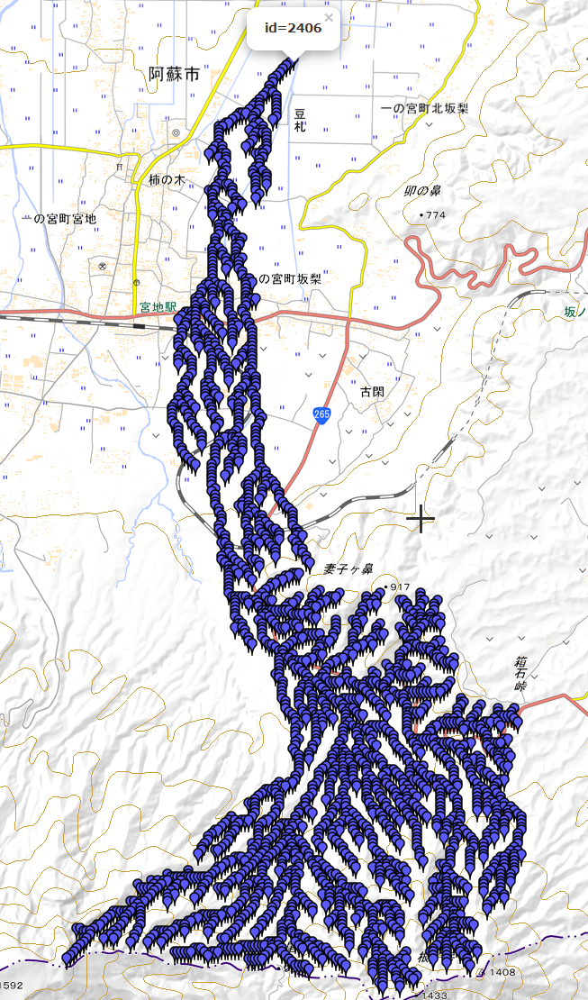
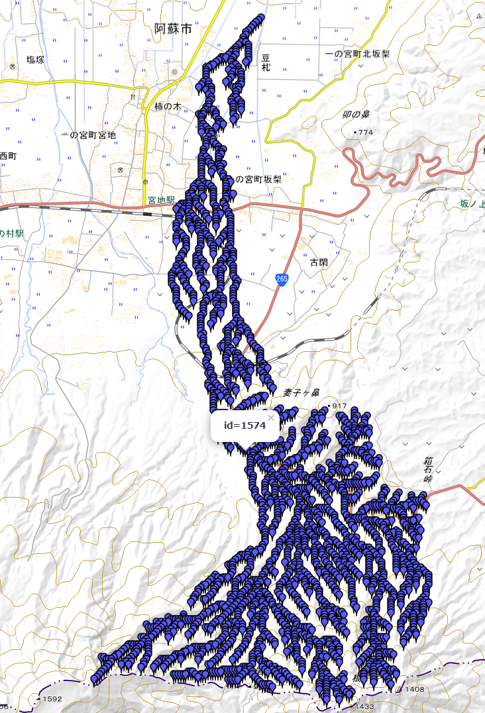
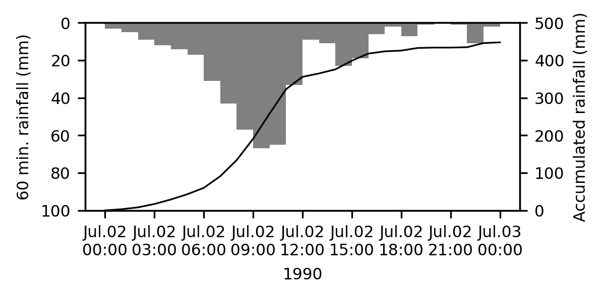
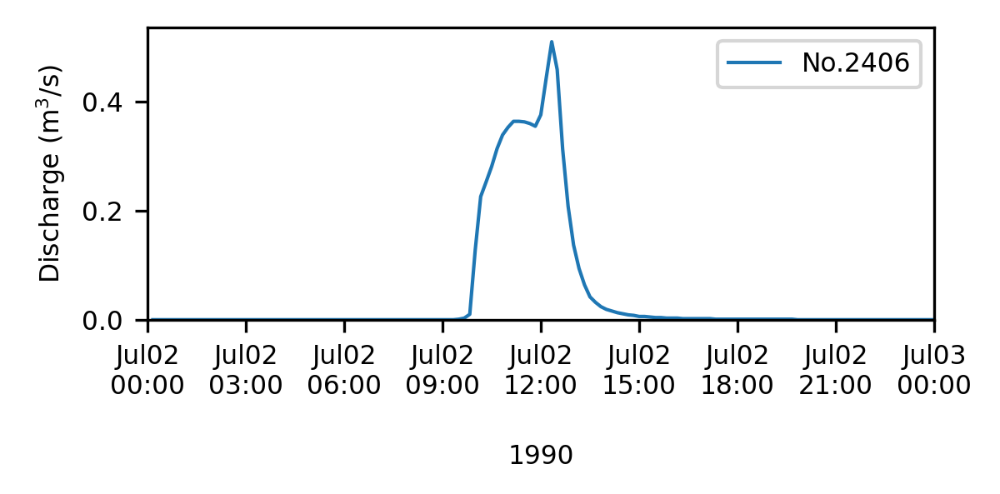
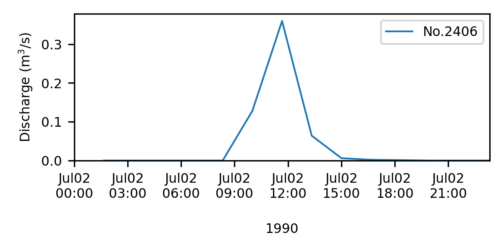
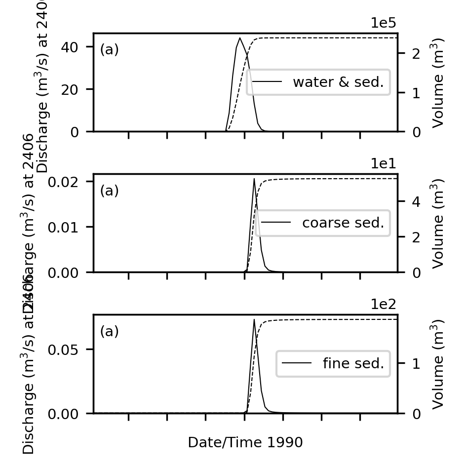
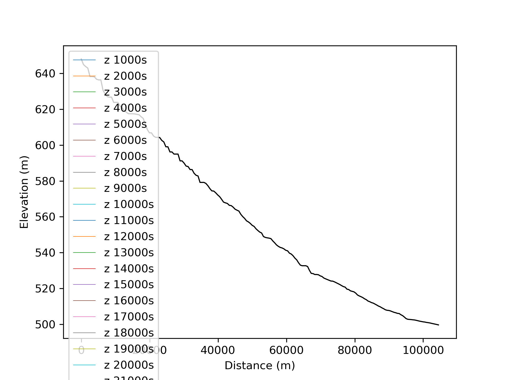
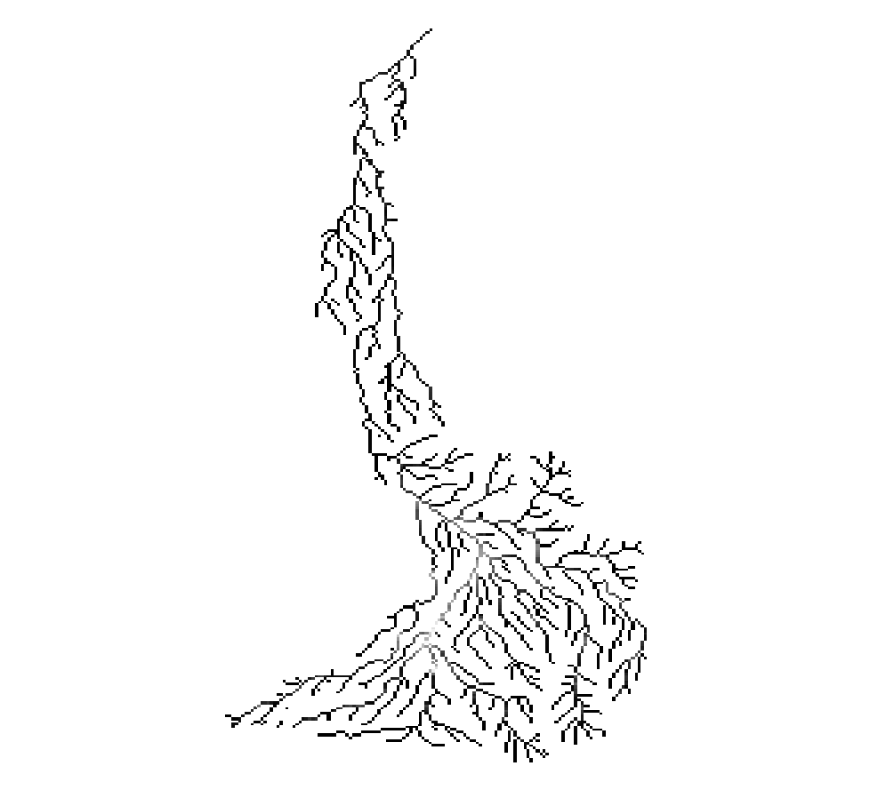
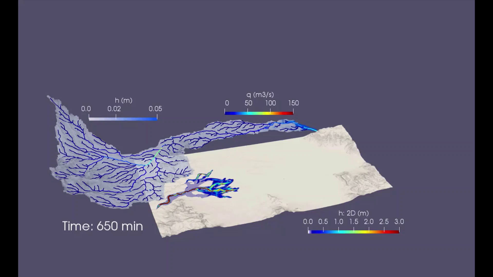
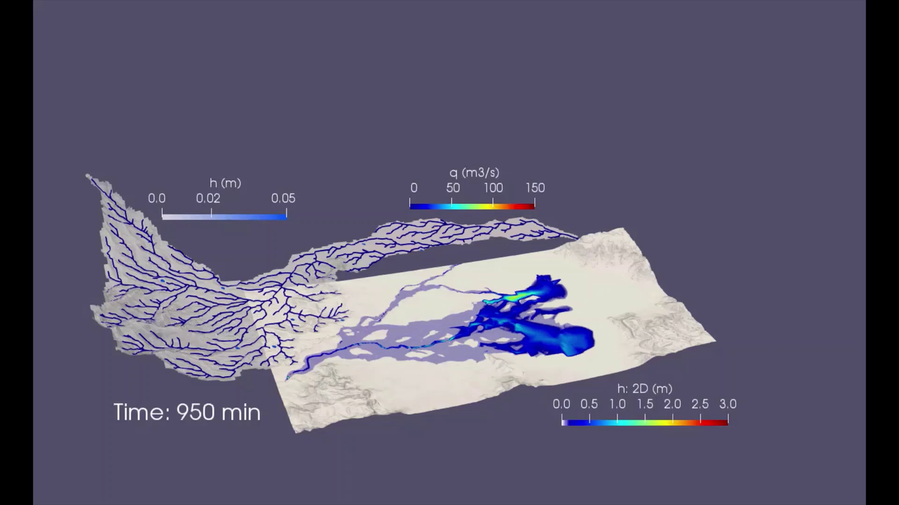

# はじめに

古恵川のデータ（`../03_furuekawa` のことをいいます。このフォルダ内のソースコードをオリジナルコードといいます。）を参考に，計算に必要な入出力ファイルをわかりやすくするためにフォルダ構成などを再整理したデータです。

以下にオリジナルコードとの相違点を示します。
ただし，前処理である地形データのGIS処理および後処理である可視化に関するプログラムは対象外としました。


## オリジナルコードの変更点

`./bin` に fortran のソースコードを収める。オリジナルコードとそのパッチファイルを収めました。

下流域地形の前処理プログラムである `01_mk_watershedConfigurationFiles.f90` および `02_mk_floodplainConfigurationFiles.f90` は，
上流域地形の前処理プログラムと区別しやすくするために，ファイル名冒頭の数値を10番台に変更しました。

RR,DR,DFの変更点は，次の通りです。変更点の詳細は 各 `.patch` ファイルを参照してください。

+ 起動直後に `openMP` で使用コア数の標準出力を追加
+ このフォルダ構成で実行できるように入出力ファイルのパス名の変更


オリジナルコード `fortran` にパッチファイルを当てると変更後のファイルが得られます。
```
patch -u < RR_to_ver_1.02.path
```
これにより，`RR_ver1.0.f90` の内容が `RR_ver1.02.f90` と同様に変更されます（ただし，上のコマンドでは`RR_ver1.0.f90`を上書きします）。
元に戻すときは，
```
patch -R < RR_to_ver_1.02.path
```
とします。

なお、`.patch` パッチファイルは `unified` 形式とし、以下のコマンドで作成しています。
```
diff -u orignal.f90 revised.f90 > .patch
```


# コンパイル方法

`fortran` ではソースコードをコンパイルすることで実行ファイルを作成します。
（コンパイルは、もうすこし正確には、インタープリターがソースコードを解釈して、リンカが関連ライブラリと関連付けて、コンパイラが機械語の実行ファイルにまとめあげるコンパイルで構成されます。）

オープンあるいは無償で利用できる `fortran` コンパイラして、`gfortran` や `Intel oneAPI HPC Toolkit` の `ifort` (将来は`ifx`に変更) があります。後者の方が計算速度が何倍も速いため、特段の理由がなければ後者の利用をおすすめします（筆者のPCではRRからDFまでの計算時間は、それぞれ前者は35時間程度、後者は8時間程度）。
インストール方法や使い方の詳細はここでは説明しません。

windows であれば、./bin/ に入った後に、以下のようにコンパイルして実行ファイルを得ます。

1. `gfortran` の場合

```
gfortran 01_mk_topographyFiles.f90 -o 01_mk_topographyFiles.exe
gfortran 02_mk_watershedConfigurationFiles.f90 -o 02_mk_watershedConfigurationFiles.exe
gfortran 03_mk_streamConfigurationFiles.f90 -o 03_mk_streamConfigurationFiles.exe
gfortran 11_mk_floodplainConfigurationFiles.f90 -o 11_mk_floodplainConfigurationFiles.exe
gfortran 12_mk_streamFloodplainConnectionFiles.f90 -o 12_mk_streamFloodplainConnectionFiles.exe
gfortran -fopenmp RR_ver_1.01.f90 -o RR_ver_1.01_omp.exe
gfortran -fopenmp DR_ver_1.01.f90 -o DR_ver_1.01_omp.exe
gfortran -fopenmp DF_ver_1.01.f90 -o DF_ver_1.01_omp.exe
```

2. `ifort` の場合

```
ifort 01_mk_topographyFiles.f90 -o 01_mk_topographyFiles.exe
ifort 02_mk_watershedConfigurationFiles.f90 -o 02_mk_watershedConfigurationFiles.exe
ifort 03_mk_streamConfigurationFiles.f90 -o 03_mk_streamConfigurationFiles.exe
ifort 11_mk_floodplainConfigurationFiles.f90 -o 11_mk_floodplainConfigurationFiles.exe
ifort 12_mk_streamFloodplainConnectionFiles.f90 -o 12_mk_streamFloodplainConnectionFiles.exe
ifort /Qopenmp /O3 RR_ver_1.02.f90 -o RR_ver_1.02_omp.exe
ifort /Qopenmp /O3 DR_ver_1.02.f90 -o DR_ver_1.02_omp.exe
ifort /Qopenmp /O3 DF_ver_1.01.f90 -o DF_ver_1.01_omp.exe
```

なお、`macOS` や `Linux` で `ifort` を使う場合、フラグは `-qopenmp -O3` となります。


# サンプルデータ

`./*.asc, ./*.txt` が 古恵川のデータにおけるDFSS の入力ファイルです。
`*.txt` のうち，`./topographyConfiguration.txt, ./RR_input.txt` 等は，パラメータファイルです。


パラメータファイルの作成方法はここには記しません。`../README.md` に示した参考文献 [1] をご確認ください。

このフォルダではこれらの前処理は実施済みという段階ですが，地形データと雨量データは以下の処理を行なうことで，DFSS の計算に必要な入力ファイルが得られます。

+ 地形データは，[Open Source GRASS GIS](https://grass.osgeo.org/) を使ったGIS処理による測地系変換やリサンプリング，方位計算処理を実施して，`./dem_10m.asc, ./dir_10m.asc, ./dem_30m.asc, ./dir_30m.asc` に変換（`_30m`, `_10m` はそれぞれ上流域，下流域の計算用データ）
+ 雨量データは，DFSS形式の雨量データに `./rain_Aso.txt` に変換


詳細は `../03_furuegawa/01_SET_BASIN` および `../03_furuegawa/02_MK_TOPO` を参照してください。

なお，方位のラスターデータ (`./dir_*m.asc`) は `GRASS GIS` による `r.watershed, r.fill.dir` によるアルゴリズムで得ることを想定しています。
他の GIS ソフトウェアの処理では方位の定義の違い等により上手く動作しない例が確認されています。


また，`./input` フォルダはこのサンプルを動かすためには使用しませんが，上に示した `./*.asc` 等の地形データや雨量データ等の入力ファイルを作成するために，ユーザが外部から収集・準備する以下のデータの保存を想定したフォルダです。

+ 流出解析を行う流域の下流末端の座標 ( `./input/coordinate.txt or ./input/outletPoint_furue.kml` ）
+ 国土地理院数値標高データ（10m B） `FG-GML-XXXX-XX-DEM10B.zip or .xml`
+ XRAINによる雨量データ
+ 下流域の計算範囲指定ファイル ( `./input/area_ll.kml` ）

`./input` フォルダには，利用規約に従ってこれらの地形データと雨量データは保存していません。


# 計算結果保存フォルダ

`./bin` のコードは実行時に必要なフォルダの有無を判定して自動生成を行ないません。

そのため，計算前に `./output_RR, ./output_RR_misc, ./output_DR, ./output_DF` をあらかじめ作成しなければなりません。
（存在しない場合，計算を実行するとエラーになります。）

本フォルダの構成をそのままご利用ください。なお，各フォルダには，`noneed.txt` という空のファイルが保存されていますが，計算には不要なファイルです。


# 並列計算で使用するコア数の設定と実行方法

`openMP` による並列計算で使用する`CPU`のコア数は，windows のコマンドプロンプト（`cmd.exe`）や `macOS` や `Linux` のターミナル (`zsh`） によって，計算を実行する前に環境変数として設定する必要があります。

`./` がカレントディレクトリとして，コアを8つ使用して計算するには，Windows の `cmd.exe` であれば以下のコマンドで実行できます。
```
set OMP_NUM_THREADS=8
bin\01_mk_topographyFiles.exe
bin\02_mk_watershedConfigurationFiles.exe
bin\03_mk_streamConfigurationFiles.exe
bin\11_mk_floodplainConfigurationFiles.exe
bin\12_mk_streamFloodplainConnectionFiles.exe
bin\RR_ver_1.02_omp.exe
bin\DR_ver_1.02_omp.exe
bin\DF_ver_1.01_omp.exe
```

なお，`macOS` や `Linux` における `zsh` 等では環境変数の設定方法（`OMP_NUM_THREADS=8` とする）やパスの冒頭にカレントディレクトリの記号をつけ `./bin` とする点、区切り文字が異なるため，使用環境にあわせて適宜変更してください。


# 計算結果の可視化


オリジナルコード `DFSS/03_Furuegawa/05_MK_FIG` の python による可視化用のコードを使いやすいように改良し `./bin_fig` に集めた。 `MK_riverNodes.py` は引数に与える値を調べられるように新たに作成したものです。
可視化用のコードは `--help` もしくは `-h` の引数を与えると使い方の詳細が分かります。
なお、様々な入力引数に対して十分にロバストに作られていませんので、エラーが生じたら、python のトレースバックのエラー情報を読み修正するなどして活用してください。


土木研究所資料4419号に掲載した図を得る方法を、RR, DR, DF の各計算過程について順に述べます。
最期に時系列データの3次元的な可視化のための `vtk` ファイルの取得をまとめて述べます。


## 上流域の河川網節点番号の取得

河道網節点番号は、後述するハイドログラフを得たい節点番号や縦断図を書きたい2点の節点番号を得るために使用します。

```
python bin_fig\MK_riverNodes.py EPSG:6670 EPSG:6668
```

氾濫解析結果は平面直角座標系（メートルでX,Yが示される座標系）で、kmlを緯度経度で得たいため、第1引数は平面直角座標系のEPSGコード、第2引数は緯度経度のEPSGコード（国土地理院が定めたJGD2011の緯度経度座標系であれば `EPSG:6668` で固定値。JGD2000 であれば `EPSG:4612`）を与える。

地理院地図で、`./river_node_lonlat.kml` を表示して、節点（ノード）をクリックすると、以下の図に示すように節点番号を得ることができる。






## 降雨流出解析（RR）の結果の可視化


1. ハイエトグラフの取得

```
python bin_fig\RR_out_hyeto.py
```

`./output_RR_fig/` のフォルダが生成され、`RR_hyeto.png` と `basin_rain.txt` が出力されます。
前者は、以下の図です。作成される図は軸の調整などを行なわないため、データによっては良い図になりません。後者のcsvはエクセルなどでグラフを作成するためのデータです。綺麗な図が得られない場合、このデータをもちいて作成し直してください。以下の説明のcsvは同様の目的で出力されます。


土石流発生時刻が分かっている場合、以下のように `--event` オプション (`-e` でも可）引数を与えると、三角形を記入できます。

```
python bin_fig\RR_out_hyeto.py --event 1990-7-2-10-20
```


複数回の土石流発生がわかっていれば、コンマ区切りで与えます（一つは機能例示のためのダミーの発生時刻なので注意）

```
python bin_fig\RR_out_hyeto.py --event 1990-7-2-9-20,1990-7-2-10-20
```


2. ハイドログラフの可視化

`./output_RR_fig` に結果が出力されます。
上の図に示した節点番号 `2406` のハイドログラフを得たいとします。

```
python bin_fig/RR_out_hydro.py 2406
```

節点番号はコンマ区切りで複数点与えることができます。



計算時間がかかる場合には、引数 `-s` （`--skip` でも可）オプションが使えます。
`-s` は `SKIP` の略で、`output_RR` の時系列データをいくつ飛ばして読むかを指定します。
`-s 10` とすれば、10ファイルごとの値を読み取って可視化します。
`RR` の計算結果として出力されたcsvファイルが `600s (=1 min`) 毎であれば、概ね `6000 s (= 10 min)` 毎に値を取得して可視化する、という意味になります。

```
python bin_fig/RR_out_hydro.py 2406 -s 10
```





この例では結果はほとんど変わりません。


## 土石流流出解析（DR）の結果の可視化

DFSSは RR-DR-DF 間は、独立に計算する弱連成解析を行うプログラムです。
そのため、DR 計算では、RR計算の斜面から河道への時系列的な流入量を元に河道の計算を行います。
RR の河道計算（水流の等流計算）とは独立ですので、双方を同時表示するのは適切ではありませんのでご注意ください。


1. セディグラフの可視化

出力データは、`./output_DR_fig` に保存されます。
各プログラムを実行すると、図とともにcsvファイルが得られます。

RR のハイドログラフと同様の引数を指定します。
`DR_hydro_at_[node_num].png` が出力されます。

```
python bin_fig/DR_out_hydro.py 2406 -s 10
```




2. 縦断情報（profile）の可視化

出力データは、`./output_DR_fig` に保存されます。
各プログラムを実行すると、図とともにcsvファイルが得られます。

引数は、上述のように河川網節点番号を調べて、上流から下流まで連続する河線の上流側の節点と下流側の節点を空白区切りで指定します。
連続しない河道網の点を選ばないとエラーになります。

```
python bin_fig/DR_profile.py 1574 2406 -s 10
```

このグラフは河道網の距離（横軸）が大きいと時系列変化がわからず、また、凡例が多いと綺麗な図にはなりません。



このプログラムは図を得るためというよりは、縦断的なCSVデータを得るために使用してください。


3. 最大流動深マップ等の可視化

出力データは `./output_DR_asc` に、`hmax.asc, dz.asc, qmax.asc, umax.asc` として保存されます。
それぞれ最大流動深、最大堆積・侵食深、最大流量の大きさ、最大速度の大きさの2次元マップを表します。
座標系は、計算と同じ平面直角座標系（この例では、JGS2011 2系: EPSG:6670）です。

```
python bin_fig/DR_map_asc.py -s 10
```

`QGIS` などで可視化できます。`hmax.asc` であれば以下のような図となります。




カラーマップを調整すると、土木研究所資料 [1] の図になります。


## 土石流氾濫解析（DF）の結果の可視化

DR の最大流動深マップ等と同様に、DFの最大流動深マップ等が得られます。
出力データは `./output_DF_map` に、
`res_hmax.asc, res_hsmax.asc, ccmax_inDF.asc, dzmax_inDF.asc, dzmin_inDF.asc, mask.asc, rain_sum.asc` として保存されます。
それぞれ最大流動深、最大地下水位（`DF_.f90`を修正しないと計算されないため使いません）、最大粗粒分土砂濃度、最大堆積真、最大侵食深、計算マスク、積算入力雨量を意味します。
座標系は、計算と同じ平面直角座標系（この例では、JGS2011 2系: EPSG:6670）です。

```
python bin/fig/DF_map_asc.py
```

`QGIS` を使って、単バンド疑似カラーで、カラーランプ `Turbo` のデフォルトで表示させると以下の図を得られます。色を調整すると、土木研究所資料 [1] の図が得られます。


## VTK ファイルの作成

時系列的に3次元空間上で表示させるために、それぞれの過程のデータを `vtk` 形式のファイルに変換できます。
結果は `paraview` などの可視化のソフトウェアをもちいて表示します。
`paraview` は動画作成や時系列的なデータを取得など様々な機能があります。
使い方の詳細は省略しますが、後日、後述する動画の作り方は掲載予定です。


1. RRの結果

RR は斜面の2次元計算結果が `cell` 形式で、河道の1次元計算結果が `line` 形式で出力されます。
出力データは、`./output_RR_vtk` に保存されます。

```
python bin_fig/RR_vtk_cell.py
python bin_fig/RR_vtk_line.py
```

2. DRの結果

DR の結果は、`output_DR_vtk` に保存されます。
DR は河道の1次元計算のため `line` 形式で出力されます。

```
python bin_fig/DR_vtk_line.py
```

3. DFの結果

DF の結果は、`output_DF_vtk` に保存されます。
DF は低地の2次元計算のため `cell` 形式で出力されます。

```
python bin/fig/DF_vtk_cell.py
```

4. 可視化画面

各フォルダの `vtk` ファイルを読み込み、`Menu bar > Filters > Alphabetical > Warp By Scalar` などで3次元化するなど各種調整を行うと、以下のような図が得られます。






動画の [ダウンロード](./img/dokenshiryou4419_DFSS_movie.mp4)


# 入力データの作成方法

後日、作成予定

